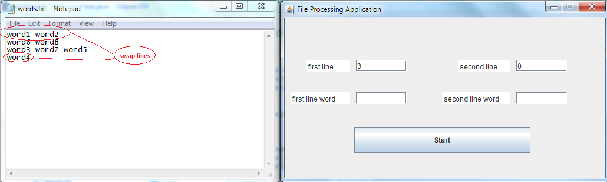
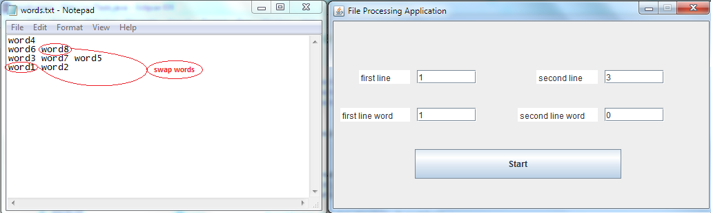

# File-Processing-Application Descriptions
 At the beginning program gets file path as command line argument. Then checks if the file is .txt 
 and throws exception if not. When path is taken all words from the file are stored in array list. Then
 program waits user to enter indexes of first and second line and to click on start button. If these text 
 fields are empty message is writen on the console. 

	There are 4 text fields(first line, second line, first line word and second line word). 
	- To swap two lines is needed only first line and second line fields to not be empty.
	- To swap two words is needed all four text field to have a value.
	
 Program checks all text fields for right input. Firstly, checks if fields contains signs different
 from (0-9) and are less than 9 signs. Otherwise throws exception. Secondly, checks if the numbers are in
 given range(to prevent null pointer exception) and throws exception if not.
	Finally, if all input is correct the program does the given action. When swap is done, the program
 writes the data stored in the array list back into the file. And prints message on the console. 

# Images
 
